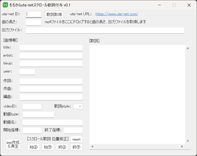

# MochiutaSC (mochikara ura-net SCroll lyrics) v0.1

## はじめに
このツールは Music Video などのmp4動画に、スクロール歌詞を付けるものです。
歌詞は uta-net (https://www.uta-net.com/) から取得します。
- MochiutaSC_1 画面

## 使いかた（さくっと）

1. MochiutaSC.zipを解凍してできたフォルダ内の、`MochiutaSC.exe`を起動します。

2. **初回起動時のみ、MPC-BE `mpc-be64.exe`のパスを聞かれます。**
    - MPC-BEをインストールしていない場合は、インストールしてそのパスを入力してください。
    - https://sourceforge.net/projects/mpcbe/

3. 起動したら、uta-net (https://www.uta-net.com/)でお目当ての曲を探します。
みつけたら、そのURLにある曲のID を **`uta-net ID`** の所に入力してください。
    - 例えばURLが https://www.uta-net.com/song/100001/ だったら、100001 を入力します。

4. **`[歌詞取得]`** を押すと歌詞を取得し、曲情報と歌詞を表示します。

5. 続けて、ダウンロードしたmp4ファイルを **ドロップ** してください。
すると **`曲の長さ`** 、**`出力ファイル`**  (assファイル)が入力されます。
    - 既にassファイルが存在する場合、その情報を曲情報と歌詞に表示します。

6. 修正するところがあれば適宜修正してください。
    - 入力必須項目は **`曲の長さ`** , **`出力ファイル`** , **`title`** , **`artist`** , **`[歌詞]`** だけです。

7. 入力が済んだら、 **`[ass作成]`** を押します。
するとassファイルが作成され、MPC-BEが起動しスクロール歌詞が表示されます。
    - リアルタイムで歌詞の変更箇所を確認したい場合、MPC-BEの「オプション」-「字幕」で「修正検知後に字幕ファイルを自動で再読み込みする」にチェックを入れてください。

8. スクロール歌詞の表示位置が画面のなかにおさまらない場合、以下のボタンで表示位置を調整してください。
MPC-BEで曲を再生中にこれらのボタンを押せば把握しやすいと思います。
    |ボタン|説明|
    |------|------|
    |**`始㊤`**|曲始めの歌詞の初期表示位置(Y座標)を120px上 ↑ にします。|
    |**`始㊦`**|曲始めの歌詞の初期表示位置(Y座標)を120px下 ↓ にします。|
    |**`終㊤`**|曲終わりの歌詞の最終表示位置(Y座標)を120px上 ↑ にします。|
    |**`終㊦`**|曲終わりの歌詞の最終表示位置(Y座標)を120px下 ↓ にします。|
    |**`reset`**|初期位置に戻します。初期位置は曲始めが480px、曲終わりが200pxです。|

**かんたん！**
あとはmp4とassをセットでもちからOFFに持ち込むなり、自宅カラオケするなりなんなり有効活用ください。
**まずはやってみてください。バグレポート待っています！**

## 項目説明 （詳しく知りたい人向け）
歌詞表示内容をカスタマイズしたい人は以下参照のこと。
- `uta-net ID`：
uta-netの曲番号、urlの /song/のあとの数字を入力してください。
URL https://www.uta-net.com/song/100001/ ⇒ 100001
    - 必須項目ではありません。
    - uta-netに歌詞がない場合、この値を入れずにタイトル、アーティスト、歌詞を入力してスクロール歌詞を作成することもできます。
    - utaidは同一楽曲かどうかの判定に使用されます。なくても機能しますが、誤った値は入力しないでください。
- `曲の長さ`：
mp4の曲の長さ(秒)、小数点以下は読み捨てます。
mp4ファイルをドロップすると、その動画の長さを取得します。
    - 歌詞表示位置の計算に使用します。
    - 直接記入もできますが、その場合は秒数で入力してください。mm:ss形式では動作しません。
- `出力ファイル`：
出力するassのファイルパス。
mp4ファイルをドロップすると、同じフォルダにassファイルを作成します。
    - 直接記入もできますが、mp4と拡張子だけ異なる同じファイル名で保存してください。
- `[曲情報]`
uta-netで取得した楽曲の情報。
これらは楽曲開始後に画面左上に30秒間表示されます。
    |項目|説明|
    |------|------|
    |`title`|曲のタイトル。必須項目|
    |`artist`|アーティスト名。必須項目|
    |`tieup`|タイアップ。uta-netにはタイアップ情報が含まれていないことがありますので、適宜補完ください。|
    |`year`|リリース年|
    |`作詞`|楽曲の作詞者名|
    |`作曲`|楽曲の作曲者名|
    |`編曲`|楽曲の編曲者名|
- `[動画情報]`
uta-netからは取得されません。必要に応じてmp4ファイルの情報を入力してください。
    - `videoID`：youtubeの動画ID。urlの watch?v= に続く英数文字、 & の前までを入力してください。
    URL https://www.youtube.com/watch?v=lkHlnWFnA0c&list=RDlkHlnWFnA0c ⇒ lkHlnWFnA0c
        - **プレイリストのアイコン表示に使用されます。**
        - vididは同一動画かどうかの判定に使用されます。なくても機能しますが、誤った値は入力しないでください。
    - `歌詞style`：表示歌詞の色、フォントを選択できます。デフォルトは1です。
        |No.|色|フォント|
        |------|------|------|
        |1.|黄緑|BIZ UDPゴシック|
        |2.|水色|BIZ UDPゴシック|
        |3.|黄色|BIZ UDPゴシック|
        |4.|橙色|HD デジタル 教科書体 NP-R|
        |5.|青色|BIZ UDP明朝 Medium|
        |6.|桃色|HGP創英角ﾎﾟｯﾌﾟ体|
        |7.|紅色|HGP創英ﾌﾟﾚｾﾞﾝｽEB|
        |8.|灰色|HGP教科書体|
    - `動画type`：同一楽曲で複数の動画がある場合、これを識別するためのものです。
    このツールでは自動的に “mv” が設定されます。
    - `動画名`：youtubeなど動画サイトでのタイトルを記入してください。
        - **曲情報と同様に、画面上部に表示されます**
    - `開始座標`：
    - `終了座標`：
    後述の [スクロール歌詞 位置修正] での値が設定されます。直接値を入力することもできます。
    数字以外の文字を入れるとエラーが発生します。
     
- `[歌詞]`
歌詞エリアです。適宜改行や空行で表示内容を調整ください。

- `[ass作成＆再生]`
ボタン押下でassの作成とMPC-BEでの楽曲再生を行います。
出力が正しいかどうか確認してください。

- `[スクロール歌詞 位置修正]`
    - `始㊤`：開始時のY座標を120ピクセル上げる（減らす）
    - `始㊦`：開始時のY座標を120ピクセル下げる（増やす）
    デフォルトでは、動画再生開始時に歌詞の先頭行をY座標480ピクセルのところに配置します。
    画面サイズを1280px x 720pxの解像度とした場合の 480pxの位置ですので、ディスプレイの実際の解像度には依存しません。
    - `終㊤`：終了時のY座標を120ピクセル上げる(減らす)
    - `終㊦`：終了時のY座標を120ピクセル下げる(増やす)
    デフォルトでは、動画再生終了時に歌詞の最終行をY座標200ピクセルのところに配置します。
    画面サイズを1280px x 720pxの解像度とした場合の 200pxの位置ですので、ディスプレイの実際の解像度には依存しません。
    - `reset`:初期位置に戻します。
    `開始座標`：、`終了座標`： に値が設定されていない場合、デフォルトの値を使用します。

以上
## 利用ソフトウェア、サイト
| ソフトウェア・サイト | URL |
|------|------|
|AutoHotKey|https://www.autohotkey.com/|
|ffmpeg|https://ffmpeg.org/|
|uta-net|https://www.uta-net.com/|
|youtube|https://www.youtube.com/|

## 免責事項
本ツールを利用して作成されたコンテンツの公開・配布に関する責任は、すべて利用者に帰属します。
本ツールは外部サービスと連携する場合がありますが、それらの仕様変更・停止等により正常に動作しなくなる可能性があります。
本ツールの仕様は予告なく変更または提供を終了する場合があります。
本ツールは現状のまま提供されており、動作の正確性・完全性・有用性について一切の保証を行いません。
利用は自己責任で行ってください。

## 変更履歴
2026/05/06 v0.1 ざっくり作成